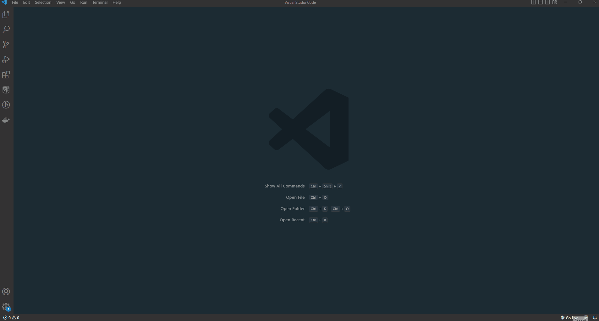
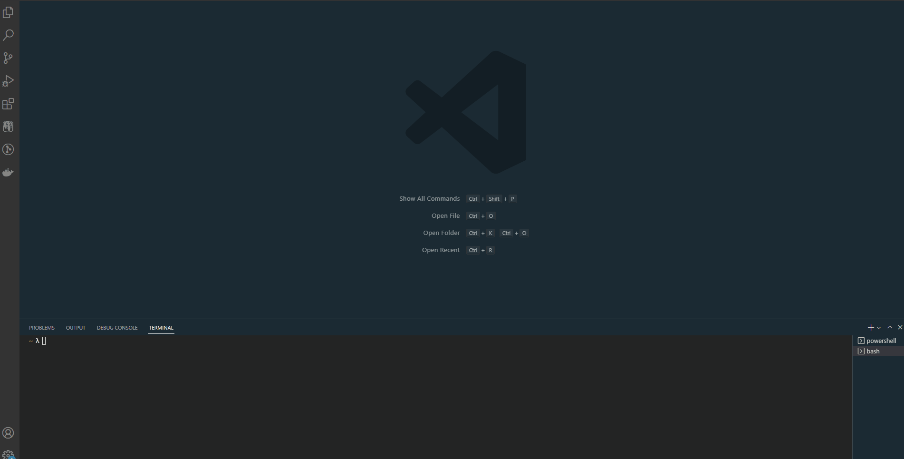
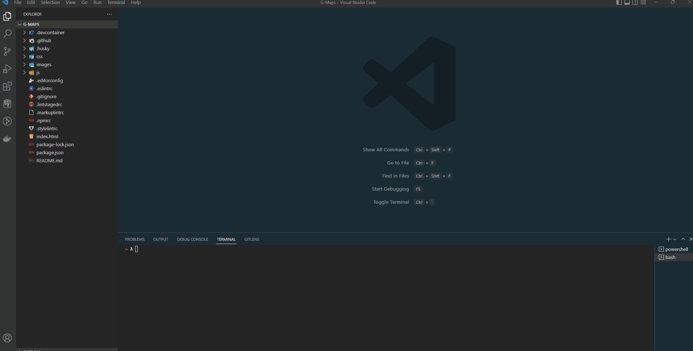

# G-Maps

A dynamic HTML, CSS, and JavaScript based web application for those interested in exploring a new area, routing from one point to another, and viewing points of interest around a single point.

## Why I built this

I enjoy working with spatial data and web maps, and I wanted to build a simple application that allows users to explore new areas around the globe and identify interesting places.

## Live Demo

See it live here:  [G-Maps](https://gquathamer.github.io/ajax-project/)

## Technologies Used

- HTML5
- CSS3
- JavaScript
- [Open Route Service API](https://openrouteservice.org/dev/#/api-docs)
- [Leaflet API](https://leafletjs.com/reference.html)

## Features

- Users can find a single location by submitting a name or address
- Users can find a single location by submitting a latitude/longitude pair
- Users can click the map interface and see information about the clicked point
- Users can get driving directions from any identified location to another
- Users can find nearby points of interest relative to an identified location

## Preview


## Development

### System Requirements

- NPM 8.1 or higher

This is a web application but having npm will allow for the activation of eslint and other style enforcement if you wish to alter the code locally.

### Getting Started

1. Open up VSCODE and a new terminal window, and select 'Git Bash' from the launch profile dropwdown

    

1. Navigate to a directory where the repository will be stored and clone the repository.

    ```shell
    git clone https://github.com/gquathamer/G-Maps.git
    ```

1. From here you can navigate into the G-Maps directory and open the directory in a new VSCODE window using the following command

    ```shell
    code .
    ```

    

1. Ensure in the new VSCODE window you've navigated to the G-Maps directory and install all dependencies with NPM.

    ```shell
    npm install
    ```
    

1. If you don't already have the Live Server extension add that and right click on index.html and select 'Open with Live Server'

      
